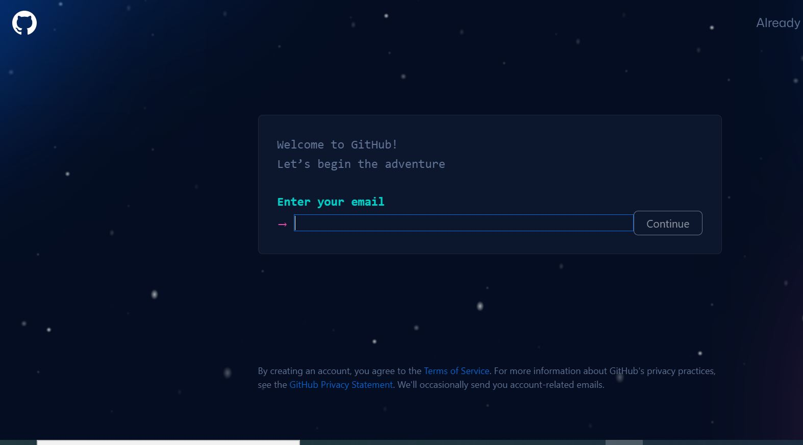
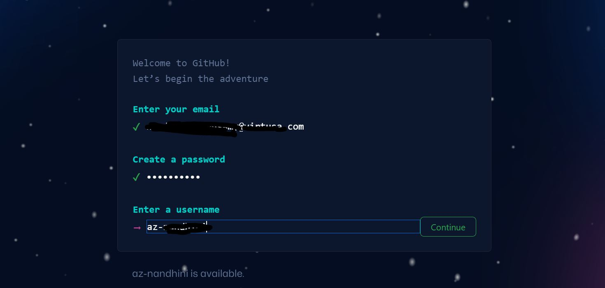
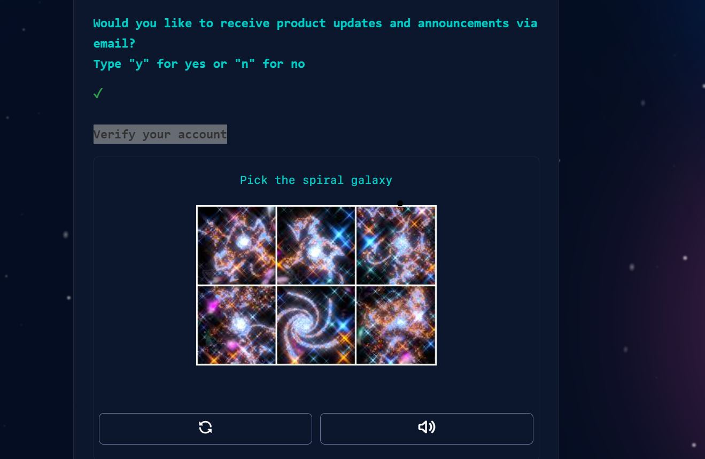
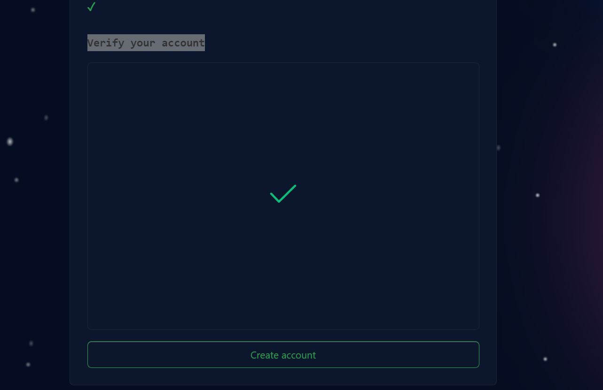
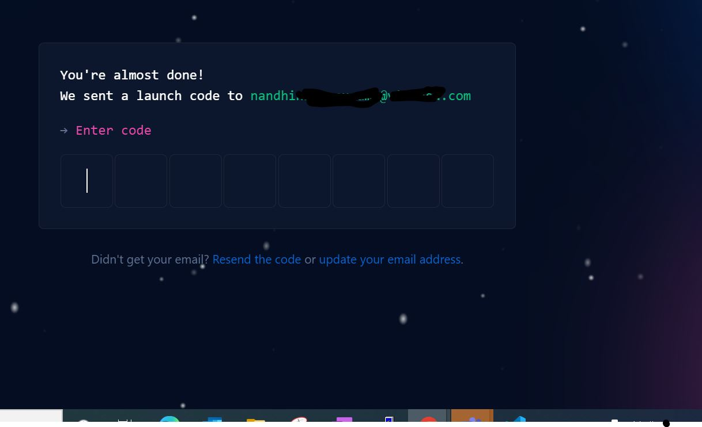
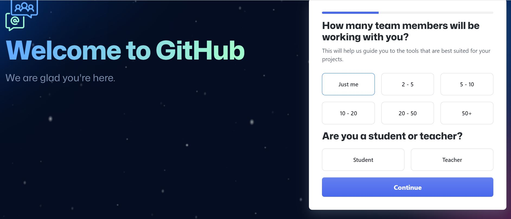
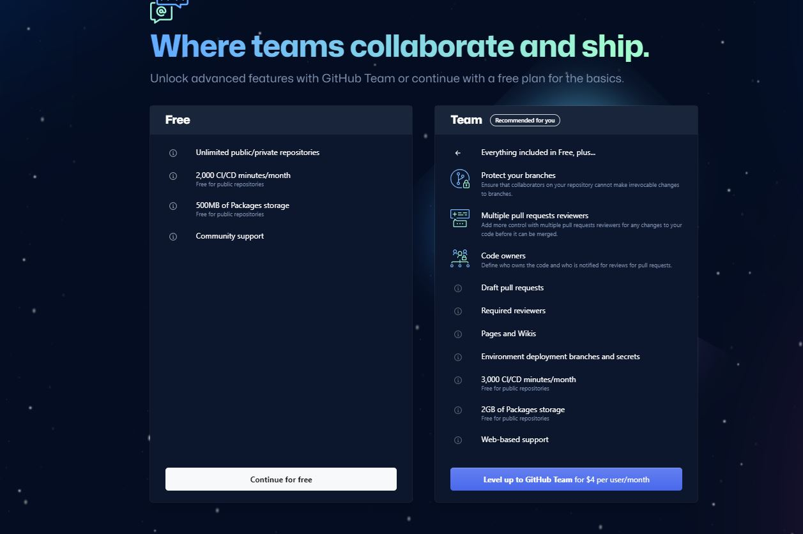
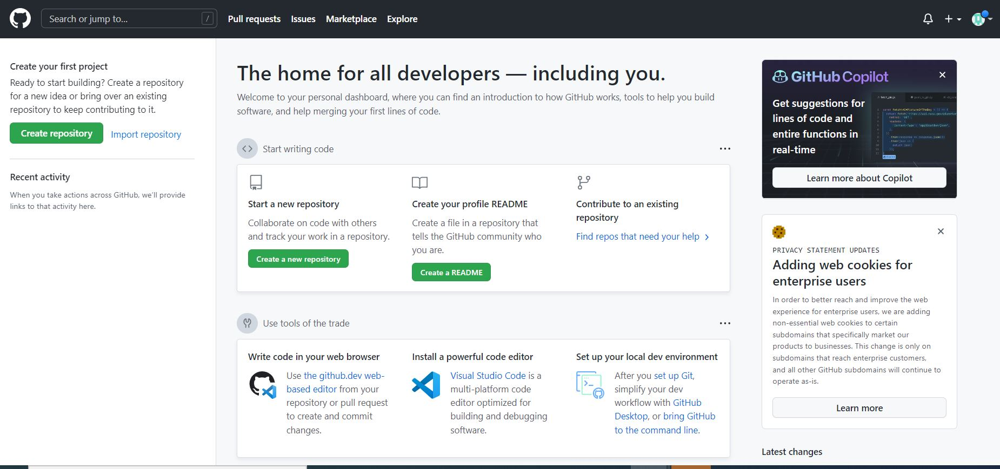
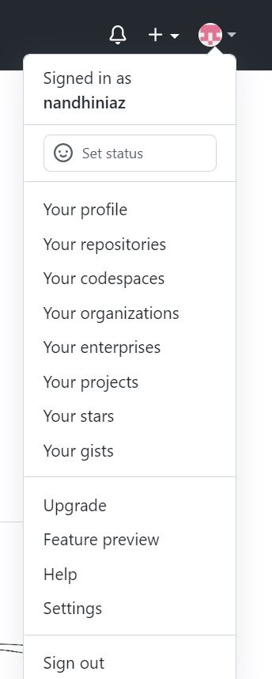
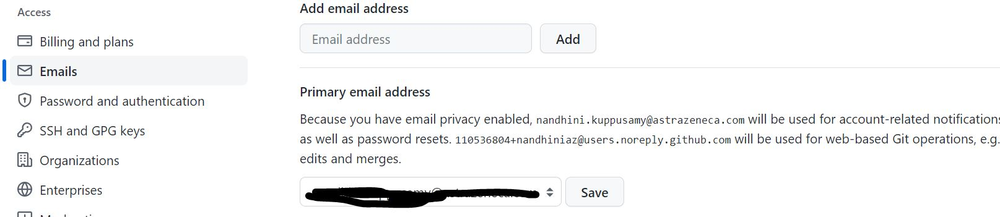

  
  &nbsp &nbsp
  

**[Github](https://github.com/)** is an application that enables you to interact with GitHub using a GUI instead of the command line or a web browser. GitHub Desktop encourages you and your team to collaborate using best practices with Git and GitHub

## Understanding Git

The core of Github is the open-source software git, which is a distributed version control and source code management software. Github adds many features onto git's functionality, including issue tracking, wiki, access control, etc.

However, Github is proprietary software, and many of it's internals remain unknown to general public.

##  Getting started with your GitHub account

With a personal account on GitHub, you can import or create repositories, collaborate with others, and connect with the GitHub community.

This guide will walk you through setting up your GitHub account and getting started with GitHub's features for collaboration and community.

## Part 1: Configuring your GitHub account

The first steps in starting with GitHub are to create an account, choose a product that fits your needs best, verify your email, set up two-factor authentication, and view your profile.

There are several types of accounts on GitHub. Every person who uses GitHub has their own personal account, which can be part of multiple organizations and teams. Your personal account is your identity on GitHub.com and represents you as an individual.

### 1. Creating an account
To sign up for an account on [GitHub.com](https://github.com/), and follow the prompts.

## About new accounts on GitHub.com 
You can create a personal account, which serves as your identity on [GitHub.com](https://github.com/), or an organization, which allows multiple personal accounts to collaborate across multiple projects. For more information about account types, see [Types of GitHub accounts.](https://docs.github.com/en/get-started/learning-about-github/types-of-github-accounts)

When you create a personal account or organization, you must select a billing plan for the account. For more information, see [GitHub's products.](https://docs.github.com/en/get-started/learning-about-github/githubs-products)

## Signing up for a new account
  1. If you want to create a new personal account, make sure you are currently signed out of GitHub.
  2. Go to [GitHub's Pricing page](https://github.com/pricing).
  3. Read the information about the different products and subscriptions that GitHub offers, then click the upgrade button under the subscription you'd like to choose.
  4. Follow the prompts to create your personal account or organization.

or you can signup to github
  1. Go to [Signup Page](https://github.com/signup) 
  
  2. Enter your email id. 
  3. Create a Password and Click on Continue. Follow Creating a strong password to secure your account. 
  4. Enter a User name and click on Continue 
   
  5. Type n for Would you like to receive product updates and announcements via email? text box. and click Continue 
  6. Verify your account by solving the Puzzle. 
   
  7. Click on Create Account  
   
  8. Enter the verification code send to your Email Id and Click on Enter. 
   
  9. Wahoo!! your Github account has been created. Continue by entering your details  
   
  10. Enter your area of Interest and click Continue 
   
  11. Choose your pricing Plan  
   
  12. You are Done creating a Github account you will be taken to the Dashboard. 
   

To keep your GitHub account secure you should use a strong and unique password. For more information, see [Creating a strong password](https://docs.github.com/en/github/authenticating-to-github/keeping-your-account-and-data-secure/creating-a-strong-password).
# Creating a strong password
Secure your account on [GitHub.com](https://github.com/) with a strong and unique password using a password manager.

You must choose or generate a password for your account on [GitHub.com](https://github.com/) that is at least:

 * **Eight characters long**, if it includes a number and a lowercase letter, or 15 characters long with any combination of characters
To keep your account secure, we recommend you follow these best practices:

 * **Use a password manager**, such as LastPass or 1Password, to generate a password of at least 15 characters.

 * **Generate a unique password for GitHub**. If you use your GitHub password elsewhere and that service is compromised, then attackers or other malicious actors could use that information to access your account on [GitHub.com](https://github.com/)

 * **Configure two-factor authentication** for your personal account. For more information, see [About two-factor authentication.](https://docs.github.com/en/articles/about-two-factor-authentication)

 * **Never share your password**, even with a potential collaborator. Each person should use their own personal account on GitHub. For more information on ways to collaborate, see: [Inviting collaborators to a personal repository](https://docs.github.com/en/articles/inviting-collaborators-to-a-personal-repository), [About collaborative development models](https://docs.github.com/en/articles/about-collaborative-development-models), or [Collaborating with groups in organizations.](https://docs.github.com/en/organizations/collaborating-with-groups-in-organizations)

 * When you type a password to sign in, create an account, or change your password, GitHub will check if the password you entered is considered weak according to datasets like HaveIBeenPwned. The password may be identified as weak even if you have never used that password before.

 * GitHub only inspects the password at the time you type it, and never stores the password you entered in plaintext. For more information, see [HaveIBeenPwned](https://haveibeenpwned.com/).

 * You can only use your password to log on to GitHub using your browser. When you authenticate to GitHub with other means, such as the command line or API, you should use other credentials. For more information, see [About authentication to GitHub.](https://docs.github.com/en/github/authenticating-to-github/about-authentication-to-github)

 * When Git prompts you for your password, enter your personal access token (PAT). Alternatively, you can use a credential helper like [Git Credential Manager](https://github.com/GitCredentialManager/git-credential-manager/blob/main/README.md). Password-based authentication for Git has been removed in favor of more secure authentication methods. For more information, see [Creating a personal access token.](https://docs.github.com/en/github/authenticating-to-github/creating-a-personal-access-token)

### 2. Verifying your email address
To ensure you can use all the features in your GitHub plan, verify your email address after signing up for a new account. 

Verifying your primary email address ensures strengthened security, allows GitHub staff to better assist you if you forget your password, and gives you access to more features on GitHub.

#### About email verification
You can verify your email address after signing up for a new account, or when you add a new email address. If an email address is undeliverable or bouncing, it will be unverified.

If you do not verify your email address, you will not be able to:

  * Create or fork repositories
  * Create issues or pull requests
  * Comment on issues, pull requests, or commits
  * Authorize OAuth App applications
  * Generate personal access tokens
  * Receive email notifications
  * Star repositories
  * Create or update project boards, including adding cards
  * Create or update gists
  * Create or use GitHub Actions
  * Sponsor developers with GitHub Sponsors

### Verifying your email address
In the upper-right corner of any page, click your profile photo, then click **Settings**.

In the "Access" section of the sidebar, click  **Emails.**

Under your email address, click Resend verification email.
**Resend verification email link**

GitHub will send you an email with a link in it. After you click that link, you'll be taken to your GitHub dashboard and see a confirmation banner.
Banner confirming that your email was verified

### Troubleshooting email verification
Unable to send verification email
You cannot verify email addresses from disposable email address services (services that allow you to receive email at a temporary address that expires after a certain time). If you'd like to keep your email address private, you can use a GitHub-provided noreply email address. For more information, see [Setting your commit email address on GitHub.](https://docs.github.com/en/articles/setting-your-commit-email-address#setting-your-commit-email-address-on-github)

Error page after clicking verification link
The verification link expires after 24 hours. If you don't verify your email within 24 hours, you can request another email verification link. For more information, see [Verifying your email address.](https://docs.github.com/en/articles/verifying-your-email-address)

If you click on the link in the confirmation email within 24 hours and you are directed to an error page, you should ensure that you're signed into the correct account on GitHub.com.

* [Sign out](https://github.com/logout) of your personal account on GitHub.com.
 * Quit and restart your browser.
 * [Sign in](https://github.com/login) to your personal account on GitHub.com.
 * Click on the verification link in the email we sent you.

### 3. Configuring two-factor authentication
Two-factor authentication, or 2FA, is an extra layer of security used when logging into websites or apps. We strongly urge you to configure 2FA for the safety of your account. For more information, see [About two-factor authentication.](https://docs.github.com/en/github/authenticating-to-github/securing-your-account-with-two-factor-authentication-2fa/about-two-factor-authentication)
